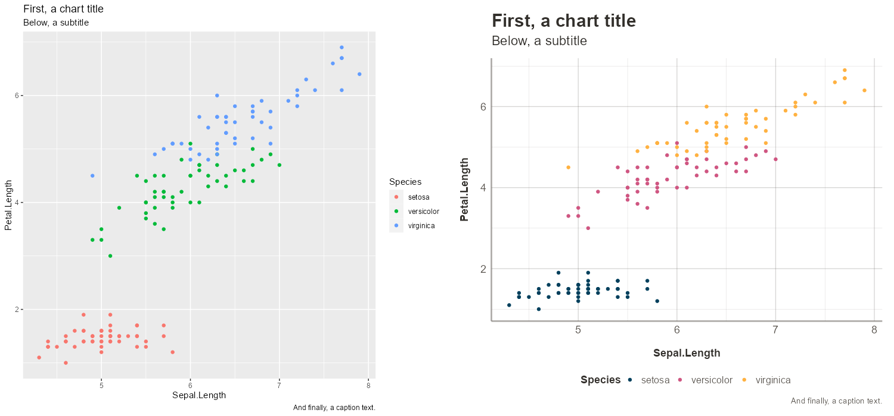
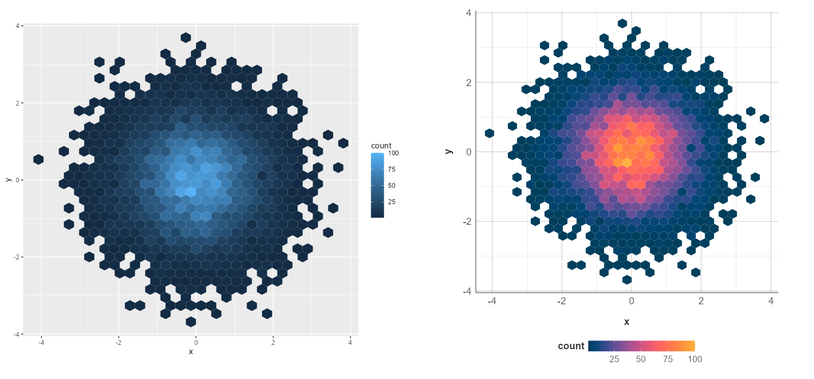

# Wax theme

Simple personal theme and palette for ggplot2

---

### Installation

```r
devtools::install_github("Waxtiz/waxtheme")
library(waxtheme)
```

### Usage

```r
library(ggplot2)
library(waxtheme)

ggplot(iris, aes(Sepal.Length, Petal.Length, color = Species)) +
  geom_point() +
  labs(title = "First, a chart title",
       subtitle = "Below, a subtitle",
       caption = "And finally, a caption text.") -> p1
p1
p1 + waxtheme::theme_wax() +
     waxtheme::scale_color_wax(discrete = T)
```



```r
df <- data.frame(x = rnorm(10000), y = rnorm(10000))
ggplot(df, aes(x = x, y = y)) +
  geom_hex() +
  coord_equal() -> p1
p1
p1 +
  theme_wax()+
  scale_fill_wax()
```


### Fonts

The fonts are previously downloaded using the `sysfonts` package, using:

```r
sysfonts::font_add_google(name = "Fira Sans", family = "fira-sans")
sysfonts::font_add_google(name = "Roboto Slab", family = "roboto-slab")

showtext::showtext_auto()
```

Alternatively, you can use the default fonts by specifying the `theme = "default"` option in the `theme_wax()` function.

```r
p1 + waxtheme::theme_wax(theme = "default")
```

